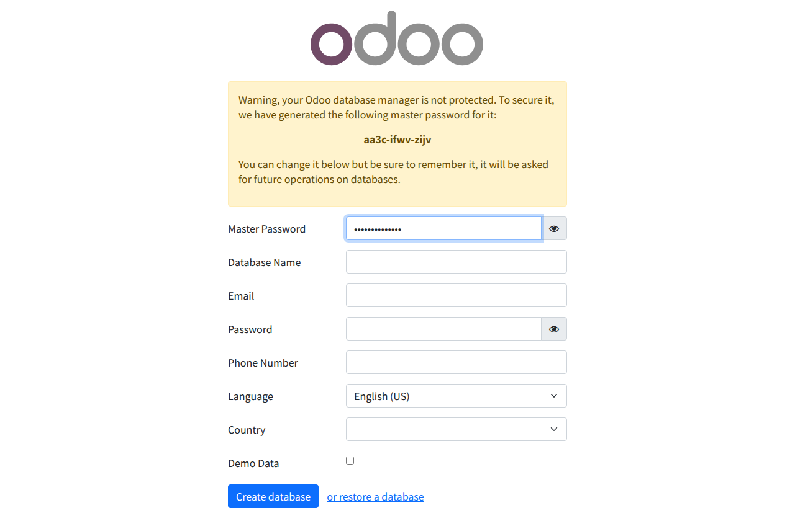

# Odoo 18.0 + Docker開発環境構築ガイド

## はじめに

Odoo開発を始めたいけど、環境構築で躓いたことはありませんか？

本記事では、Dockerを使ってOdoo 18.0（2024年10月リリースの最新版）の開発環境を簡単に構築する方法を紹介します。GitHub CLI（gh）やPre-commitも含めた、OCA準拠の開発環境を目指します。

> **注意**: Docker HubのOdooイメージは最新版を追従しています。執筆時点ではOdoo 18.0が最新です。

## 完成形

```
odoo-dev-env/
├── Dockerfile              # カスタムイメージ
├── docker-compose.yml      # サービス定義
├── config/
│   └── odoo.conf          # Odoo設定
├── addons/                 # カスタムモジュール
└── workspace/             # 作業ディレクトリ
```

## 必要なもの

- Docker & Docker Compose
- Git
- 約2GBのディスク容量

## ステップバイステップ

### 1. プロジェクト作成

```bash
mkdir odoo-dev-env
cd odoo-dev-env
```

### 2. Dockerfile作成

```dockerfile
FROM odoo:18.0  # Odoo 18.0（2024年10月リリース）

USER root

# 開発ツールインストール
RUN apt-get update && apt-get install -y \
    git vim nano curl wget \
    postgresql-client python3-pip \
    nodejs npm \
    && rm -rf /var/lib/apt/lists/*

# GitHub CLIインストール
RUN curl -fsSL https://cli.github.com/packages/githubcli-archive-keyring.gpg | \
    dd of=/usr/share/keyrings/githubcli-archive-keyring.gpg && \
    chmod go+r /usr/share/keyrings/githubcli-archive-keyring.gpg && \
    echo "deb [arch=$(dpkg --print-architecture) signed-by=/usr/share/keyrings/githubcli-archive-keyring.gpg] https://cli.github.com/packages stable main" | \
    tee /etc/apt/sources.list.d/github-cli.list > /dev/null && \
    apt-get update && apt-get install -y gh

# Pre-commitインストール
RUN pip3 install pre-commit

# 開発用Pythonパッケージ
RUN pip3 install debugpy pylint-odoo flake8 black isort pytest

USER odoo
```

### 3. Docker Compose設定

```yaml
services:
  db:
    image: postgres:16
    environment:
      - POSTGRES_DB=postgres
      - POSTGRES_PASSWORD=odoo
      - POSTGRES_USER=odoo
    volumes:
      - odoo-db-data:/var/lib/postgresql/data/pgdata

  odoo:
    build: .
    depends_on:
      - db
    environment:
      - HOST=db
      - USER=odoo
      - PASSWORD=odoo
    volumes:
      - odoo-web-data:/var/lib/odoo
      - ./addons:/mnt/extra-addons
      - ./workspace:/workspace
    command: odoo --dev=all

volumes:
  odoo-web-data:
  odoo-db-data:
```

### 4. 起動

```bash
docker compose up -d
```

ブラウザで `http://localhost:8069` （ポートを変更した場合は `http://localhost:18069`）にアクセス。

**初期設定画面:**



初回アクセス時はデータベース作成画面が表示されます。画面の指示に従ってデータベースを作成してください。

## よくあるトラブル

### ポートの競合（Incus/LXC環境など）

特権ポート（1024未満）でエラーが出る場合は、非特権ポートを使用してください：

```yaml
# docker-compose.yml でポートを変更
ports:
  - "18069:8069"
```

アクセス時は `http://localhost:18069` を使用します。

**ホスト側での対処（必要に応じて）：**
```bash
# ホスト側で特権ポートの制限を緩和
sudo sysctl net.ipv4.ip_unprivileged_port_start=80
```

### 権限エラー

```bash
# ディレクトリ権限の修正
sudo chown -R $USER:$USER ./addons ./workspace
```

### DB接続エラー

コンテナ起動直後はPostgreSQLの起動に時間がかかる場合があります。30秒ほど待ってから再度アクセスしてください。

```bash
# ログで確認
docker compose logs -f db
```

## 次のステップ

環境ができたら、OCAのPre-commit設定を導入して、品質の高いコードを書く準備をしましょう。

（次回記事：OCA PreCommit完全ガイド）

---

*本記事はAI自給自足計画の一環として作成されました*

#Odoo #Docker #OCA #開発環境 #AI自給自足計画
