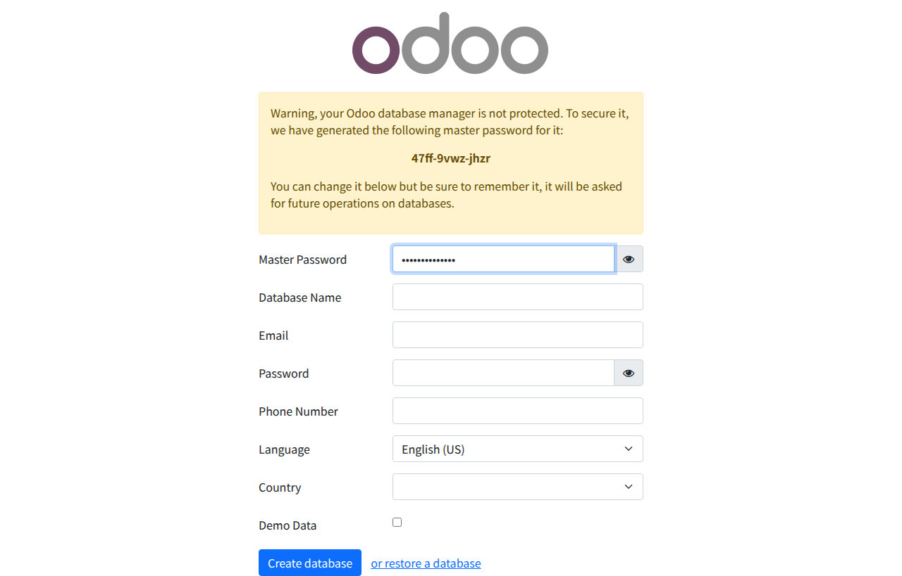

# VSCode + Odoo 18.0 デバッグ環境構築ガイド

## はじめに

Odooモジュール開発をするなら、**VSCode + Dev Containers**が最強です。

本記事では、Dockerコンテナ内でVSCodeを使って、ブレークポイントやステップ実行ができる開発環境を構築します。

## 前提条件

- VSCodeインストール済み
- VSCode拡張機能「Remote - Containers」インストール済み
- Docker & Docker Compose インストール済み

## 完成形

```
odoo-docker-compose/
├── .devcontainer/
│   └── devcontainer.json    # Dev Container設定
├── .vscode/
│   ├── launch.json          # デバッグ設定
│   └── settings.json        # VSCode設定
├── docker-compose.yml
└── ...
```

## ステップバイステップ

### Step 1: リポジトリをクローン

```bash
git clone https://github.com/tkuratty/odoo-docker-compose.git
cd odoo-docker-compose
git checkout 19.0
```

### Step 2: VSCodeで開く

```bash
code .
```

### Step 3: Dev Containerで開く

VSCodeの左下に表示される「Reopen in Container」をクリック：


または、コマンドパレット（F1）で：
```
Remote-Containers: Reopen in Container
```

### Step 4: コンテナが起動するまで待つ

初回はDockerイメージのビルドに数分かかります。VSCodeの下部に進捗が表示されます。

### Step 5: Odooにアクセス

コンテナが起動したら、ブラウザで以下のURLにアクセス：

```
http://localhost:18069
```

**データベース管理画面：**



初回アクセス時は、データベース作成画面が表示されます。

### Step 6: デバッグ実行

1. VSCodeの「実行とデバッグ」アイコンをクリック（Ctrl+Shift+D）
2. 「Odoo: Run with Debug」を選択
3. F5キーでデバッグ開始

**ブレークポイントの設定：**
- ソースコードの左側の余白をクリック
- 赤い丸が表示されたらブレークポイント設定完了

**デバッグ操作：**
- F5: 続行
- F10: ステップオーバー（次の行へ）
- F11: ステップイン（関数内へ）
- Shift+F11: ステップアウト（関数から脱出）
- F9: ブレークポイント切り替え

## ファイル構成の詳細

### .devcontainer/devcontainer.json

```json
{
  "name": "Odoo 18.0 Development",
  "dockerComposeFile": "../docker-compose.yml",
  "service": "odoo",
  "workspaceFolder": "/workspace",
  "shutdownAction": "stopCompose",
  
  "customizations": {
    "vscode": {
      "extensions": [
        "ms-python.python",
        "ms-python.debugpy",
        "ms-python.vscode-pylance",
        "redhat.vscode-xml"
      ]
    }
  },
  
  "postCreateCommand": "pip install --user debugpy"
}
```

### .vscode/launch.json

```json
{
  "version": "0.2.0",
  "configurations": [
    {
      "name": "Odoo: Run with Debug",
      "type": "debugpy",
      "request": "launch",
      "program": "/usr/bin/odoo",
      "args": [
        "--config=/etc/odoo/odoo.conf",
        "--dev=all"
      ],
      "console": "integratedTerminal"
    }
  ]
}
```

## よくある問題と解決策

### Q: "Reopen in Container"が表示されない

A: Remote - Containers拡張機能がインストールされているか確認：
```
Ctrl+Shift+X → "Remote - Containers"を検索 → インストール
```

### Q: コンテナ起動に失敗する

A: ログを確認：
```
F1 → "Remote-Containers: Show Container Log"
```

### Q: ブレークポイントで止まらない

A: debugpyがインストールされているか確認：
```bash
# コンテナ内で実行
pip list | grep debugpy
```

ない場合は：
```bash
pip install debugpy
```

### Q: ポートが既に使われている

A: `docker-compose.yml` でポートを変更：
```yaml
ports:
  - "28069:8069"  # 別のポートを使用
```

## 便利なショートカット一覧

| キー | 機能 |
|------|------|
| F5 | デバッグ実行/続行 |
| F10 | ステップオーバー |
| F11 | ステップイン |
| Shift+F11 | ステップアウト |
| F9 | ブレークポイント切り替え |
| Ctrl+Shift+P | コマンドパレット |
| Ctrl+Shift+D | 実行とデバッグパネル |
| Ctrl+` | 統合ターミナル |

## 次のステップ

環境ができたら、実際にOdooモジュールを開発してみましょう！

- [Odooモジュール開発入門](../module-development/README.md)
- [OCAコーディング規約](../oca-guidelines/README.md)

---

*本記事はAI自給自足計画の一環として作成されました*

#Odoo #VSCode #DevContainer #デバッグ #Docker #AI自給自足計画
